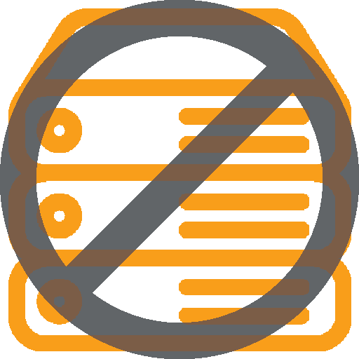
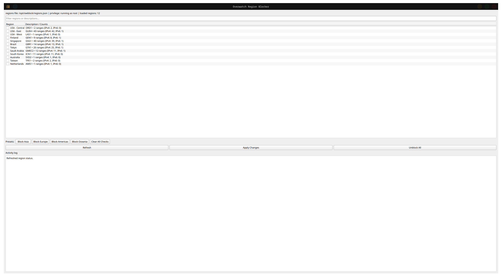

<table>
  <tr>
    <td></td>
    <td><h1>OWBlock [Overwatch Region Selector]</h1></td>
  </tr>
</table>

> [!CAUTION]
> Not affiliated with Blizzard, use at your own risk.

## Install

```bash
tar -xzf OWBlock-linux-x86_64-v0.1.1.tar.gz
cd OWBlock-linux-x86_64-v0.1.1
sudo ./scripts/install-owblock.sh
```

## Uninstall
```bash
sudo ./scripts/uninstall-owblock.sh
```

## Launch

- Menu: **OWBlock**
- Terminal: `owblock`

> [!IMPORTANT]
> - If connection hangs/fails, make sure to unblock all servers to avoid a competitive ban. 
> - Restarting the game appears to produce the best results when unblocking/blocking servers.

## Notes
- Requires `python3-venv` on the host.
- Requires `nftables` on the host.
- The launcher uses the working pattern:
  `pkexec env DISPLAY=$DISPLAY XAUTHORITY=$XAUTHORITY XDG_RUNTIME_DIR=$XDG_RUNTIME_DIR ...`

## Screenshots


## CLI-only version

A smaller CLI-only release is available if you do not want the desktop app.

## Install / extract

```bash
tar -xzf OWBlock-cli-linux-x86_64-v0.1.1.tar.gz
cd OWBlock-cli-linux-x86_64-v0.1.1
```

## Usage
```bash
sudo ./owblock-cli list

sudo ./owblock-cli status

sudo ./owblock-cli block "Singapore"

sudo ./owblock-cli unblock "Singapore"

sudo ./owblock-cli unblock-all
```

## Acknowledgements

- [stowmyy/dropship](https://github.com/stowmyy/dropship)
- [foryVERX/Overwatch-Server-Selector](https://github.com/foryVERX/Overwatch-Server-Selector/)

> [!TIP]
> Feel free to fork the project or update the region block list as it will not be actively maintained. Users can update their own region lists by editing this file directly, adding or modifying region entries with the correct JSON structure. After saving the file, restart or refresh the app to load the new ranges.